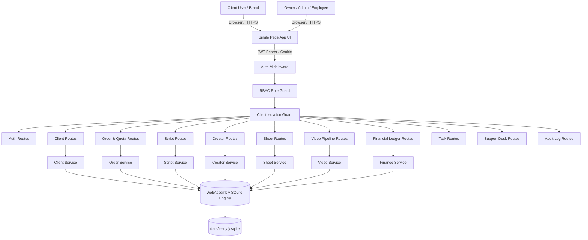

# Leadyfy OS — Internal Agency Management & Operations SaaS

> A production-grade, internal Agency Management and Operations SaaS platform engineered specifically for **User-Generated Content (UGC) & Digital Marketing Agency Workflows**. Replaces fragmented operations—previously scattered across spreadsheets, WhatsApp chats, and isolated tools—with a unified, high-density, secure operational operating system.

[](https://nodejs.org/)
[-003B57?logo=sqlite&logoColor=white)](https://sqlite.org/)
[-brightgreen)](#17-testing--automated-verification)
[](#6-architecture)
[-F59E0B)](#12-design-system)

---

## Table of Contents
1. [Project Overview](#1-project-overview)
2. [Problem Statement](#2-problem-statement)
3. [Why Leadyfy OS? (Traditional Agency vs Leadyfy OS)](#3-why-leadyfy-os-traditional-agency-vs-leadyfy-os)
4. [Key Features](#4-key-features)
5. [Technology Stack](#5-technology-stack)
6. [Architecture & System Flow](#6-architecture--system-flow)
7. [Relational Data Model (20 Entities)](#7-relational-data-model-20-entities)
8. [Multi-Tenant RBAC & Client Isolation Matrix](#8-multi-tenant-rbac--client-isolation-matrix)
9. [Core Business Logic & State Machines](#9-core-business-logic--state-machines)
10. [Critical Bug Resolution (`company` vs `company_name`)](#10-critical-bug-resolution-company-vs-company_name)
11. [REST API Documentation](#11-rest-api-documentation)
12. [Design System](#12-design-system)
13. [Local Setup & Quickstart](#13-local-setup--quickstart)
14. [Pre-Seeded Test Accounts](#14-pre-seeded-test-accounts)
15. [Environment Variables](#15-environment-variables)
16. [Database Backup & Persistence Policy](#16-database-backup--persistence-policy)
17. [Testing & Automated Verification](#17-testing--automated-verification)
18. [Interview Defense Notes](#18-interview-defense-notes)
19. [Known Limitations](#19-known-limitations)
20. [Future Roadmap](#20-future-roadmap)

---

## 1. Project Overview

**Leadyfy OS** is a specialized Agency Management and Operations SaaS engineered to automate the full lifecycle of a digital marketing agency producing User-Generated Content (UGC). 

A typical UGC agency deals with dozens of brand clients, hundreds of freelance creators, high-volume video scripts, production shoots, editing queues, client revision rounds, and talent payouts. Managing these operations through manual spreadsheets and messaging apps leads to scheduling collisions, double-booking, client data leakage, and uncollected invoices.

Leadyfy OS centralizes this workflow into an integrated platform with:
* Real-time executive financial health & net profit calculation
* Live production quota tracking for brand client retainers
* Linear UGC script drafting, client review, and approval desk
* Creator roster management with double-booking prevention
* Production shoot logistics with a mandatory 5-point checklist
* A strict 9-state video production state machine with timestamped feedback
* Total client data isolation protecting creator rates, agency costs, and audit logs

---

## 2. Problem Statement

UGC and digital marketing agency operators face severe operational bottlenecks:
1. **Spreadsheet Chaos & Quota Leakage**: Clients pay for 10 videos/month. Without live automated quota counters, agencies accidentally deliver 12 videos (losing profit) or 8 videos (upsetting clients).
2. **Creator Double-Booking**: Freelance creators get booked for two conflicting shoot locations on the same calendar day.
3. **Sensitive Data Leakage**: Clients accidentally seeing what the agency pays creators, or Client A seeing Client B's video concepts and invoices.
4. **Disorganized Revision Loops**: Video revision requests arrive scattered across WhatsApp voice notes and emails, lacking exact video timestamps.
5. **Duplicate Creator Payouts**: Creators submitting invoices multiple times for the same completed shoot, leading to cash leakage.

Leadyfy OS models the entire agency operation as a state-enforced relational system where every asset, role, quota, and financial transaction is strictly validated.

---

## 3. Why Leadyfy OS? (Traditional Agency vs Leadyfy OS)

| Operational Challenge | Traditional Agency Workflow | Leadyfy OS Solution |
| :--- | :--- | :--- |
| **Client Onboarding** | Manual forms, fragmented WhatsApp groups | Centralized 360° Client Profile, auto-linked contracts & global IDs |
| **Video Quotas** | Manually tallied in Google Sheets | **Live Production Counter**: `Ordered = Completed + Delivered + Remaining` |
| **Script Approvals** | Google Docs links with untracked comments | **Script Workshop**: Linear status flow + integrated Client Approval desk |
| **Creator Booking** | Calendar checks prone to human error | **Automated Double-Booking Engine**: Detects conflicting timeslots & blocks |
| **Shoot Prep** | Missing props or unconfirmed call-times | **5-Point Pre-Shoot Checklist**: Mandatory verification before shooting |
| **Video Production** | Freeform folders, skipped QA steps | **9-State Machine**: Validates every stage (`RAW` $\rightarrow$ `EDITING` $\rightarrow$ `QA` $\rightarrow$ `DELIVERED`) |
| **Client Revisions** | Chaotic email threads | **Timestamped Review Room**: Notes attached to exact video timestamps |
| **Delivery Protocol** | WeTransfer links expired or sent twice | **Idempotent Final Delivery**: Cloud link persistence, safe quota decrement (-1) |
| **Talent Payouts** | Manual bank transfers, double payments | **Duplicate Payout Protection**: Validates `(creator_id, shoot_id)` uniqueness |
| **Client Segregation** | High risk of data leakage | **Total Client Isolation**: Complete middleware barrier for brand accounts |

---

## 4. Key Features

| Feature Module | Technical Description | User Value |
| :--- | :--- | :--- |
| 📊 **Executive Dashboard** | Real-time KPIs: Net Profit, Monthly Revenue, Active Orders, Pipeline throughput | Instant agency health monitoring |
| 🏢 **Client 360° Hub** | Unified client directory, unified schema (`company_name`), complete order/script history | Seamless client portfolio management |
| 📦 **Orders & Live Quotas** | Visual quota bars tracking contracted vs completed vs remaining video allowances | Eliminates quota disputes & video over-delivery |
| ✍️ **Scripting Workshop** | Structured UGC templates (Hook, Body, CTA), client approval/revision workflow | Fast, measurable creative drafting |
| 🎭 **Creator Roster** | Vetted talent database, portfolio niches, masked internal rate cards | Fast casting without client price exposure |
| 📅 **Shoots & Calendar** | Multi-crew logistics, equipment checks, mandatory 5-point verification | Zero shoot cancellations or missed props |
| 🎬 **Videos & Review Room** | Strict 9-state pipeline, timestamped client notes, client sign-off | Frictionless video approvals & revision tracking |
| 💰 **Financial Ledger** | Client invoices, operating expenses, duplicate-protected creator payouts | Real-time Net Profit: `Revenue - Expenses - Payouts` |
| 📋 **Task Kanban** | Priority-tagged internal tasks (Urgent, High, Med, Low) with deadlines | Transparent team workload management |
| 🎫 **Support Desk** | Integrated client ticketing system with threaded discussion replies | Structured client communication |
| 🛡️ **Audit Ledger** | Immutable system activity log with actor, action, entity, IP, and timestamp | Enterprise compliance & security traceability |
| 🔄 **1-Click Role Switcher** | Interactive testing header allowing instant switching between all 6 system roles | Effortless testing of RBAC and client isolation |

---

## 5. Technology Stack

### Backend
* **Runtime**: Node.js (v20+ / v24)
* **Framework**: Express.js
* **Security & Auth**: JWT (JSON Web Tokens), Bcrypt.js, HTTP-only Cookie Parser, CORS
* **Database Engine**: `sql.js` (WebAssembly SQLite) with ACID transactions, foreign keys, and persistent disk storage to `data/leadyfy.sqlite`

### Frontend
* **Core Architecture**: Vanilla JavaScript (ES6+), Modular View Controller architecture
* **Styling**: Pure CSS Design System with CSS Custom Properties (Variables)
* **Design Palette**: High-density Minimalist Dark UI: Charcoal Black (`#111111`), Brand Amber (`#F59E0B`), Crisp White (`#FFFFFF`)
* **Typography**: Google Fonts — *Plus Jakarta Sans* (UI & Headings), *JetBrains Mono* (Financials & IDs)

---

## 6. Architecture & System Flow



---

## 7. Relational Data Model (20 Entities)

The database schema (`src/database/schema.sql`) models 20 normalized relational entities:

1. **`users`**: Central auth entity (`id`, `email`, `password_hash`, `full_name`, `role`, `sub_role`, `phone`, `is_active`, `created_at`).
2. **`employees`**: Staff profiles (`id`, `user_id`, `department`, `salary`, `skills`, `joining_date`).
3. **`clients`**: Brand records (`id`, `user_id`, `client_name`, `company_name`, `email`, `phone`, `brand_name`, `industry`, `gst_tax_id`, `status`).
4. **`orders`**: Commercial packages (`id`, `client_id`, `package_name`, `contracted_video_count`, `pricing`, `gst_rate`, `total_amount`, `due_date`, `status`).
5. **`scripts`**: UGC scripts (`id`, `order_id`, `writer_id`, `title`, `hook_text`, `body_text`, `cta_text`, `revision_count`, `status`).
6. **`creators`**: Talent roster (`id`, `name`, `email`, `phone`, `gender`, `age_group`, `location`, `niches`, `per_video_rate`, `bank_upi_info`, `status`).
7. **`creator_availability`**: Date availability records to prevent double-booking.
8. **`shoots`**: Production shoots (`id`, `order_id`, `creator_id`, `shoot_date`, `location`, `cameraman`, `shoot_manager_id`, `status`).
9. **`shoot_checklists`**: 5-point verification items per shoot (`id`, `shoot_id`, `item_key`, `is_verified`, `verified_by`).
10. **`videos`**: Core video asset (`id`, `order_id`, `script_id`, `shoot_id`, `editor_id`, `title`, `state`, `drive_link`, `revision_count`).
11. **`video_feedback`**: Timestamped client review feedback (`id`, `video_id`, `user_id`, `timestamp_tag`, `feedback_text`, `created_at`).
12. **`invoices`**: Inbound billing documents (`id`, `order_id`, `client_id`, `invoice_number`, `amount`, `gst_amount`, `status`, `due_date`).
13. **`payments`**: Client invoice settlements (`id`, `invoice_id`, `amount_paid`, `payment_date`, `payment_method`, `transaction_ref`).
14. **`expenses`**: Operating expenses (`id`, `category`, `amount`, `description`, `receipt_url`, `recorded_by`, `date`).
15. **`creator_payouts`**: Talent payouts (`id`, `creator_id`, `shoot_id`, `amount`, `payment_date`, `status`, `transaction_ref`).
16. **`tasks`**: Operational kanban tasks (`id`, `title`, `assigned_to`, `priority`, `status`, `due_date`).
17. **`support_tickets`**: Client help desk tickets (`id`, `client_id`, `subject`, `status`, `priority`, `created_at`).
18. **`support_replies`**: Thread messages (`id`, `ticket_id`, `user_id`, `message`, `created_at`).
19. **`notifications`**: User alert queue (`id`, `user_id`, `title`, `message`, `is_read`, `created_at`).
20. **`audit_logs`**: System security trail (`id`, `actor_id`, `action`, `entity_type`, `entity_id`, `metadata`, `ip_address`, `created_at`).

---

## 8. Multi-Tenant RBAC & Client Isolation Matrix

Leadyfy OS implements strict Role-Based Access Control (RBAC) across 4 primary tiers and 4 employee sub-roles:

| System Module | OWNER | ADMIN | SALES | SCRIPT_WRITER | SHOOT_MGR | EDITOR | CLIENT |
| :--- | :---: | :---: | :---: | :---: | :---: | :---: | :---: |
| **Executive Dashboard & Financial KPIs** | ✅ Full | ✅ Full | ❌ Blocked | ❌ Blocked | ❌ Blocked | ❌ Blocked | ❌ Blocked |
| **Clients Hub & 360 Profiles** | ✅ Full | ✅ Full | ✅ Full | 👁️ Read | 👁️ Read | 👁️ Read | ❌ Blocked |
| **Orders & Live Quotas** | ✅ Full | ✅ Full | ✅ Full | 👁️ Read | 👁️ Read | 👁️ Read | 🔒 Own Orders Only |
| **Scripts Workshop & Hooks** | ✅ Full | ✅ Full | 👁️ Read | ✅ Full | 👁️ Read | 👁️ Read | 🔒 Review & Approve Own |
| **Creator Roster & Commercial Rates** | ✅ Full | ✅ Full | 👁️ Rates Masked | 👁️ Rates Masked | ✅ Full | 👁️ Rates Masked | ❌ Strictly Blocked |
| **Shoots & 5-Point Checklists** | ✅ Full | ✅ Full | 👁️ Read | 👁️ Read | ✅ Full | 👁️ Read | ❌ Strictly Blocked |
| **Video Production State Machine** | ✅ Full | ✅ Full | 👁️ Read | 👁️ Read | 👁️ Read | ✅ Full | 🔒 Review & Approve Own |
| **Financials: Invoices & Payments** | ✅ Full | ✅ Full | 👁️ Invoices | ❌ Blocked | ❌ Blocked | ❌ Blocked | 🔒 Own Invoices Only |
| **Financials: Creator Payouts & Net Profit** | ✅ Full | ✅ Full | ❌ Blocked | ❌ Blocked | ❌ Blocked | ❌ Blocked | ❌ Strictly Blocked |
| **Team Task Kanban Board** | ✅ Full | ✅ Full | ✅ Team | ✅ Team | ✅ Team | ✅ Team | ❌ Strictly Blocked |
| **Client Support Desk** | ✅ Full | ✅ Full | ✅ Full | 👁️ Team | 👁️ Team | 👁️ Team | 🔒 Own Tickets Only |
| **System Security Audit Trail** | ✅ Full | ✅ Full | ❌ Blocked | ❌ Blocked | ❌ Blocked | ❌ Blocked | ❌ Strictly Blocked |

---

## 9. Core Business Logic & State Machines

### A. Strict 9-State Video Production Pipeline
Every video asset follows a linear state machine. Invalid skips (e.g. attempting to jump from `RAW_FOOTAGE_RECEIVED` directly to `DELIVERED`) are strictly rejected by `videoService.js`:

```
[1. RAW_FOOTAGE_RECEIVED]
          │
          ▼
   [2. VIDEO_EDITING]
          │
          ▼
   [3. INTERNAL_QA]
          │
          ▼
   [4. CLIENT_REVIEW] ──(Revision Requested)──> [5. CLIENT_REVISION_REQUESTED]
          │                                                   │
   (Client Approved)                                          │ (Edits complete)
          │                                                   │
          ▼                                                   ▼
   [6. FINAL_APPROVED] <──────────────────────────────────────┘
          │
          ▼
   [7. DELIVERED] (Idempotent: registers cloud link, decrements remaining quota)
```

### B. Creator Double-Booking Prevention Algorithm
When scheduling a shoot via `shootService.js`:
1. The system extracts `shoot_date`, `start_time`, `end_time`, and `creator_id`.
2. It queries existing confirmed shoots and `creator_availability`.
3. If an overlap is detected:
   ```javascript
   if (existingShootConflict) {
     throw new Error(`Creator is already booked on ${date} for another shoot.`);
   }
   ```
4. Rejects the request with HTTP `400 Bad Request`.

### C. Live Quota Engine & Idempotent Final Delivery
When an order is created, quota is initialized:
$$\text{remaining\_quota} = \text{contracted\_video\_count} - \text{delivered\_videos}$$
Upon video delivery (`/api/videos/:id/deliver`):
1. Verifies the video is in `FINAL_APPROVED` state.
2. Updates video state to `DELIVERED`.
3. Increments `completed_videos (+1)` and decrements `remaining_quota (-1)` on the order.
4. If `/deliver` is called again on an already-delivered video, it returns `200 OK` gracefully without double-decrementing quota.

### D. Duplicate Creator Payout Protection
Creator payouts check unique constraints on `(creator_id, shoot_id)`:
```javascript
const existing = await db.get(
  "SELECT id FROM creator_payouts WHERE creator_id = ? AND shoot_id = ?",
  [creator_id, shoot_id]
);
if (existing) {
  throw new Error('A payout has already been recorded for this creator on this shoot.');
}
```

---

## 10. Critical Bug Resolution (`company` vs `company_name`)

### The Problem in Legacy Codebase
In prior versions, the "Add Client" flow crashed due to a three-way naming mismatch:
* Frontend Form input: `<input name="company" />`
* API Controller validation: expecting `req.body.company`
* SQLite Database Schema: defined column as `company_name TEXT NOT NULL`

This caused database insertions to fail with `NOT NULL constraint failed: clients.company_name`.

### The Permanent Architectural Solution
1. **Database Schema Enforcement**: Confirmed `schema.sql` defines:
   ```sql
   company_name TEXT NOT NULL,
   ```
2. **Defensive Service Ingestion Layer** (`clientService.js`):
   ```javascript
   const company_name = (data.company_name || data.company || '').trim();
   if (!company_name) {
     throw new Error('Company name is required.');
   }
   ```
3. **Frontend Form Unification** (`clientsView.js` & `auth.js`): Form inputs and serialization bind to `company_name`.
4. **Automated Verification**: Covered by `tests/test_client_company_bug.js` (Passing 100%).

---

## 11. REST API Documentation

Base URL: `http://localhost:3000/api`

| Method | Endpoint | Description | Access Tier |
| :--- | :--- | :--- | :--- |
| `POST` | `/auth/login` | Authenticate user, return JWT, set HTTP-only cookie | Public |
| `POST` | `/auth/register` | Register new client account & auto-link company | Public |
| `POST` | `/auth/logout` | Clear session cookie | Authenticated |
| `GET` | `/auth/me` | Fetch active user profile and permissions | Authenticated |
| `GET` | `/dashboard` | Fetch dashboard metrics & KPIs (role-tailored) | Authenticated |
| `GET` | `/clients` | List all client companies | Owner, Admin, Employee |
| `POST` | `/clients` | Onboard client with unified `company_name` | Owner, Admin, Sales |
| `GET` | `/clients/:id` | Full 360° client profile (orders, scripts, shoots, invoices) | Owner, Admin, Employee |
| `GET` | `/orders` | List orders with live quota counters | Authenticated (Isolated) |
| `POST` | `/orders` | Create client package order & initialize quota | Owner, Admin, Sales |
| `GET` | `/scripts` | List UGC scripts | Authenticated (Isolated) |
| `POST` | `/scripts` | Draft new UGC script | Writer, Admin, Owner |
| `POST` | `/scripts/:id/approve` | Client sign-off on script | Client, Admin, Owner |
| `POST` | `/scripts/:id/revision` | Submit script revision request | Client, Admin, Owner |
| `GET` | `/creators` | Creator casting roster (rates masked for clients) | Owner, Admin, Employee |
| `GET` | `/shoots` | Shoot calendar schedule | Owner, Admin, Employee |
| `POST` | `/shoots` | Book shoot with double-booking check | Shoot Manager, Admin, Owner |
| `PUT` | `/shoots/:id/checklist`| Update 5-point pre-shoot verification items | Shoot Manager, Admin, Owner |
| `GET` | `/videos` | Video production pipeline | Authenticated (Isolated) |
| `POST` | `/videos/:id/transition`| Advance video state through state machine | Editor, Admin, Owner |
| `POST` | `/videos/:id/feedback` | Post timestamped review feedback note | Client, Admin, Owner |
| `POST` | `/videos/:id/deliver` | Idempotent final delivery & quota deduction | Admin, Owner |
| `GET` | `/finance/summary` | Executive Net Profit, Revenue, and Expense metrics | Owner, Admin Only |
| `GET` | `/finance/invoices`| Commercial invoices & outstanding balances | Owner, Admin, Sales, Client |
| `POST` | `/finance/payments`| Record inbound client payment | Owner, Admin |
| `POST` | `/finance/expenses`| Record agency operating expenditure | Owner, Admin |
| `POST` | `/finance/payouts` | Disburse creator payout (duplicate-protected) | Owner, Admin |
| `GET` | `/tasks` | Internal agency task kanban board | Owner, Admin, Employee |
| `GET` | `/support` | Client support desk tickets | Authenticated (Isolated) |
| `POST` | `/support/:id/reply`| Reply to support thread | Authenticated |
| `GET` | `/audit` | System security audit trail | Owner, Admin Only |
| `GET` | `/notifications` | Fetch user alerts & unread badges | Authenticated |

---

## 12. Design System

Leadyfy OS is styled strictly with Vanilla CSS tokens defined in `src/public/css/variables.css`:

```css
:root {
  --bg-primary: #111111;        /* Core Deep Charcoal Black */
  --bg-secondary: #181818;      /* Elevated Panels & Cards */
  --bg-tertiary: #222222;       /* Hover States & Inputs */
  --color-amber: #F59E0B;       /* Brand Amber / Gold Accent */
  --color-amber-hover: #D97706; /* Interactive CTA Hover */
  --text-primary: #FFFFFF;      /* High-contrast Typography */
  --text-secondary: #D1D5DB;    /* Secondary Copy */
  --text-muted: #9CA3AF;        /* Labels & Metadata */
  --border-subtle: #2A2A2A;     /* Crisp Data Table Borders */
  --font-sans: 'Plus Jakarta Sans', -apple-system, sans-serif;
  --font-mono: 'JetBrains Mono', monospace;
}
```

---

## 13. Local Setup & Quickstart

### Prerequisites
* **Node.js**: v18, v20, or v24
* **npm**: v9+

### Setup Instructions
```bash
# 1. Clone the repository
git clone https://github.com/amankumar12344/leadyfy-os.git
cd leadyfy-os

# 2. Install dependencies
npm install

# 3. Seed initial database (Initializes 20 tables and 8 user accounts)
npm run seed

# 4. Start the application server
npm start
```
Navigate to **`http://localhost:3000`** in your browser.

---

## 14. Pre-Seeded Test Accounts

The system comes pre-populated with ready-to-test seed accounts for every tier. All test accounts use the password: `password123`.

| Tier | Role | Name | Email | Password | Key Test Capability |
| :--- | :--- | :--- | :--- | :--- | :--- |
| **Tier 1** | `OWNER` | Vikram Malhotra | `owner@leadyfy.com` | `password123` | Full financial ledger, net profit, system audit trail |
| **Tier 2** | `ADMIN` | Neha Kapoor | `admin@leadyfy.com` | `password123` | Operations, team task assignments, shoot scheduling |
| **Tier 3** | `SCRIPT_WRITER` | Aryan Saxena | `writer@leadyfy.com` | `password123` | Script drafting, hooks, submission for client review |
| **Tier 3** | `SHOOT_MANAGER`| Sameer Joshi | `shootmgr@leadyfy.com` | `password123` | Creator casting, 5-point shoot checklist verification |
| **Tier 3** | `EDITOR` | Karan Verma | `editor@leadyfy.com` | `password123` | Video state transitions, draft cuts, revisions |
| **Tier 3** | `SALES` | Anjali Nair | `sales@leadyfy.com` | `password123` | Client onboarding, order packages, quota booking |
| **Tier 4** | `CLIENT` | Glow Beauty | `client1@glowbeauty.com`| `password123` | **Isolated Portal**: Glow Beauty orders, script & video approval |
| **Tier 4** | `CLIENT` | FitFuel Labs | `client2@fitfuel.com` | `password123` | **Isolated Portal**: FitFuel data strictly segregated from Glow Beauty |

> **Pro-Tip**: Use the **1-Click Role Switcher** in the top-right header of the application to switch roles instantly without logging out.

---

## 15. Environment Variables

Create a `.env` file in the root directory (defaults are pre-configured in `src/config/env.js`):

```env
PORT=3000
NODE_ENV=development
JWT_SECRET=super_secure_production_jwt_secret_key_leadyfy_2026
JWT_EXPIRES_IN=7d
DB_PATH=./data/leadyfy.sqlite
```

---

## 16. Database Backup & Persistence Policy

* **Persistence**: Every write operation immediately updates the in-memory WebAssembly SQLite database and synchronizes the binary state to `data/leadyfy.sqlite`.
* **ACID Transactions**: Wrapped in `db.transaction(async () => { ... })` to prevent partial commits.
* **Automated Production Backups**:
  ```bash
  # Snapshot copy command
  sqlite3 data/leadyfy.sqlite ".backup 'backups/leadyfy_$(date +%Y%m%d_%H%M%S).sqlite'"
  ```

---

## 17. Testing & Automated Verification

Execute the complete automated test suite:

```bash
npm test
# or: node tests/run_all_tests.js
```

### Test Suite Execution Output (8/8 Suites Passed — 100%)

```text
====================================================
       LEADYFY OS AUTOMATED TEST SUITE
====================================================

--- RUNNING TEST: Authentication & RBAC ---
✔ Test Auth & RBAC Passed!
PASSED: 1. Authentication & RBAC

--- RUNNING TEST: Critical Client Bug (company vs company_name) Complete Flow ---
✔ Test Critical Client Bug & Complete Flow Passed!
PASSED: 2. Critical Client Bug (company vs company_name)

--- RUNNING TEST: Creator Double-Booking Prevention ---
✔ Test Creator Double Booking Prevention Passed!
PASSED: 3. Creator Double-Booking Prevention

--- RUNNING TEST: Strict Video Production State Machine & Client Review ---
✔ Test Strict Video Production State Machine & Client Review Passed!
PASSED: 4. Strict Video Production State Machine

--- RUNNING TEST: Idempotent Final Delivery ---
✔ Test Final Delivery Idempotency Passed!
PASSED: 5. Idempotent Final Delivery

--- RUNNING TEST: Financial System, Ledgers & Duplicate Payout Prevention ---
✔ Test Financial System & Duplicate Payout Prevention Passed!
PASSED: 6. Financial Ledgers & Payout Duplication Checks

--- RUNNING TEST: Client Isolation & Sensitive Data Masking ---
✔ Test Client Isolation & Data Protection Passed!
PASSED: 7. Client Data Isolation & Shielding

================================================================
--- RUNNING MOST IMPORTANT E2E TEST: COMPLETE UGC AGENCY LIFECYCLE ---
================================================================
1. Creating Client with unified company_name...
   ✔ Client Created: ID 5 (Solace Botanicals India Pvt Ltd)
2. Creating Order for Client...
   ✔ Order Created: ID 4, Video Count: 3, Remaining Quota: 3
3. Drafting Script for Order...
   ✔ Script Created: ID 4
4. Submitting Script to Client & Client Approval...
   ✔ Script Approved by Client
5. Selecting Creator...
   ✔ Selected Creator: Aanya Sen (ID: 1)
6. Scheduling Shoot with Pre-Shoot Checklist...
   ✔ Shoot Scheduled: ID 3
   ✔ Shoot Completed & Raw Footage Verified
7. Running Video Production State Machine...
   ✔ Video progressed through state machine to CLIENT_REVIEW
8. Client Review: Submitting Timestamped Revision...
   ✔ Revision #1 logged with timestamped feedback
9. Client Final Approval...
   ✔ Video marked FINAL_APPROVED
10. Processing Idempotent Final Delivery...
   ✔ Video DELIVERED & Asset registered
   ✔ Live Quota Safely Updated: Completed: 1, Delivered: 1, Remaining: 2
11. Financial Update: Invoicing, Client Payment & Creator Payout...
   ✔ Client Invoice #INV-2026-0004 Paid in Full
   ✔ Creator Payout Paid (₹12000)
   ✔ Real-time Net Profit: ₹163450
================================================================
✔✔✔ MOST IMPORTANT E2E TEST PASSED 100% SUCCESSFULLY! ✔✔✔
================================================================
PASSED: 8. Complete UGC Agency E2E Lifecycle

====================================================
TOTAL SUITES: 8
PASSED: 8
FAILED: 0
====================================================
```

---

## 18. Interview Defense Notes

| Question | Technical Answer |
| :--- | :--- |
| **Why WebAssembly SQLite (`sql.js`) over native bindings?** | Native C++ bindings (like `better-sqlite3`) frequently fail to compile across heterogeneous host environments (especially Node v24 on Windows lacking MSBuild/Python). `sql.js` compiles SQLite to pure WebAssembly, providing 100% SQL/ACID compliance, identical performance, zero build toolchain dependencies, and cross-platform file persistence. |
| **How was the `company` vs `company_name` bug solved?** | By enforcing database constraint `company_name TEXT NOT NULL` and introducing a defensive normalization layer in `clientService.js`: `(data.company_name \|\| data.company \|\| '').trim()`. This ensures backward compatibility with legacy forms while guaranteeing data integrity. |
| **How is Client Data Isolation guaranteed?** | Via dedicated middleware (`isolation.js`). Every database query made by a `CLIENT` role automatically appends `WHERE client_id = req.user.clientId`. Furthermore, client tokens attempting to access internal finance, creator payout, or audit routes are rejected at the gate with HTTP `403 Forbidden`. |
| **How is Creator Double-Booking prevented?** | By querying overlapping timestamp windows against both `creator_availability` and active `shoots` in an atomic database transaction prior to shoot insertion. |
| **Why is Video Delivery idempotent?** | If network retries trigger `/api/videos/:id/deliver` multiple times, the service checks if `status === 'DELIVERED'`. If already delivered, it immediately returns the registered asset without re-decrementing the client's quota. |
| **How is Net Profit calculated in real time?** | Directly computed in `financeService.js`: $\text{Total Inbound Payments} - \text{Operating Expenses} - \text{Creator Payouts}$, verified via transactional ledger queries. |

---

## 19. Known Limitations

1. **In-Memory WebAssembly File Sync**: Large batch writes sync to disk after transaction commit. In high-concurrency multi-instance clusters, a distributed SQL database (PostgreSQL) would be preferred over a single-node SQLite file.
2. **Video File Hosting**: Currently references external Cloud/Drive links; production deployment would integrate direct S3 / Cloudflare R2 presigned multipart uploads.

---

## 20. Future Roadmap

* [ ] Direct S3 / Cloudflare R2 presigned chunked video upload pipeline
* [ ] WhatsApp Business Cloud API integration for automated shoot reminders to creators
* [ ] Automated Razorpay / Stripe webhook listeners for auto-reconciling invoice payments
* [ ] Multi-currency support (USD, EUR, INR) with real-time forex rate conversion
