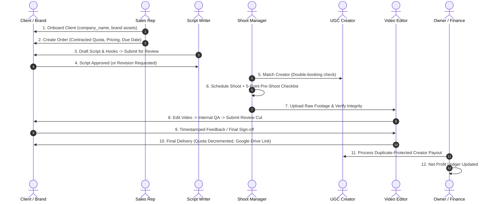

# Leadyfy OS — Complete Operational Workflow Guide

This document details the exact, end-to-end operational lifecycle implemented in **Leadyfy OS**, covering all 10 stages from initial client lead onboarding to final video delivery and financial ledger reconciliation.

---

## High-Level Operational Lifecycle

---

## Stage-by-Stage Breakdown

### Stage 1: Client Lead Conversion & Onboarding
- **Actors**: Sales Rep / Admin / Owner
- **Interface**: `Clients` Module (`clientsView.js`)
- **Action**:
  - The agency creates a new client account using the **"Add Client"** modal.
  - Form fields collected: Client Name, Company Name (`company_name`), Work Email, Phone/WhatsApp, Industry, Brand Assets link, and GST/Tax ID.
  - **Solved Bug**: The system unifies `company` vs `company_name` across form inputs, API payload, and SQLite database.
  - **Database Effect**: Creates a record in `users` (Role: `CLIENT`), links a record in `clients`, and initializes audit trail log `CLIENT_CREATED`.

---

### Stage 2: Commercial Package & Order Creation
- **Actors**: Sales Rep / Admin
- **Interface**: `Orders & Quotas` Module (`ordersView.js`)
- **Action**:
  - Sales team books a package order for the onboarded client (e.g., "10 UGC Video Growth Bundle", ₹1,50,000 + 18% GST).
  - Specifies: Total Contracted Video Count (e.g., 10), Total Amount, Advance Payment, and Delivery Deadline.
  - **Live Quota Engine**: Initializes order counters:
    - `total_videos_ordered = 10`
    - `completed_videos = 0`
    - `delivered_videos = 0`
    - `remaining_quota = 10`
  - Automatically generates an initial invoice in the Financial Ledger.

---

### Stage 3: Manual Scriptwriting & Hook Workshop (No AI)
- **Actors**: Script Writer (`writer@leadyfy.com`)
- **Interface**: `Scripts & Hooks` Module (`scriptsView.js`)
- **Action**:
  - Writer is assigned to an active client order.
  - Writer crafts the video concept: Hook, Problem, Solution/Product Demo, Call to Action (CTA), language, and reference TikTok/Reels links.
  - Initial state: `DRAFT` $\rightarrow$ `ASSIGNED` $\rightarrow$ `IN_REVIEW`.
  - Once reviewed internally, the writer clicks **"Submit to Client"**, moving the status to `SENT_TO_CLIENT`.

---

### Stage 4: Client Script Approval & Commentary
- **Actors**: Client (`client1@glowbeauty.com`)
- **Interface**: Client Portal $\rightarrow$ `Scripts & Hooks`
- **Action**:
  - Client logs in and sees only scripts belonging to their brand.
  - The client can either:
    - **Approve Script**: Transitions script state to `APPROVED` and tags it as `READY_FOR_SHOOT`.
    - **Request Revision**: Leaves specific comments. State transitions to `REVISION_REQUIRED`, increments revision counter, and alerts the script writer.

---

### Stage 5: Creator Casting & Double-Booking Prevention
- **Actors**: Shoot Manager (`shootmgr@leadyfy.com`)
- **Interface**: `Creator Roster` Module (`creatorsView.js`)
- **Action**:
  - Shoot Manager browses vetted creators filtered by niche, language, age group, and past performance.
  - **Sensitive Data Masking**: Creator commercial rates, bank info, and UPI IDs are strictly hidden from clients.
  - **Double-Booking Engine**: The system checks `creator_availability` and existing shoot calendar slots. If a creator is already booked for an overlapping time slot, the booking is rejected with `400 Bad Request`.

---

### Stage 6: Shoot Scheduling & 5-Point Checklist
- **Actors**: Shoot Manager
- **Interface**: `Production Shoots` Module (`shootsView.js`)
- **Action**:
  - Schedules shoot: Date, Time, Location, Cameraman, Shoot Manager, Shooting Assistant, and Approved Scripts.
  - **Enforces 5-Point Pre-Shoot Checklist**:
    1. [x] Script Approval Verified
    2. [x] Creator Booking & Call-Time Confirmed
    3. [x] Location & Equipment Permissions Secured
    4. [x] Client Product Sample Received & Inspected
    5. [x] Technical Team Briefed
  - **Post-Shoot Verification**: After shoot completion, manager uploads raw footage Drive links and checks file integrity before marking shoot `COMPLETED`.

---

### Stage 7: Video Editing & Production State Machine
- **Actors**: Video Editor (`editor@leadyfy.com`)
- **Interface**: `Videos & Review` Module (`videosView.js`)
- **Action**:
  - Editor's dashboard sorts projects by urgency (Overdue, Due Today, Due Tomorrow).
  - Video asset transitions strictly through the 9-state pipeline:
    `RAW_FOOTAGE_RECEIVED` $\rightarrow$ `VIDEO_EDITING` $\rightarrow$ `INTERNAL_QA` $\rightarrow$ `CLIENT_REVIEW`.
  - Invalid transitions (e.g. attempting to skip from Raw Footage straight to Delivered) are rejected by the server.

---

### Stage 8: Client Review Room & Timestamped Feedback
- **Actors**: Client (`client1@glowbeauty.com`)
- **Interface**: Client Portal $\rightarrow$ `Videos & Review`
- **Action**:
  - Client watches the draft video cut in their private portal.
  - Client can add **Timestamped Feedback** (e.g., *"00:04 - Music volume too loud, increase voiceover"*).
  - Clicking **"Request Revision"** moves status to `CLIENT_REVISION_REQUESTED`, increments revision count, and assigns back to editor.
  - Clicking **"Approve Video"** marks video as `FINAL_APPROVED`.

---

### Stage 9: Idempotent Final Delivery & Live Quota Deduction
- **Actors**: System / Admin
- **Interface**: `Videos & Review` Module (`videosView.js`)
- **Action**:
  - Upon final approval, the final high-resolution Google Drive link is registered.
  - Video status transitions to `DELIVERED`.
  - **Live Quota Update**:
    - `completed_videos = completed_videos + 1`
    - `delivered_videos = delivered_videos + 1`
    - `remaining_quota = remaining_quota - 1`
  - **Idempotency Guarantee**: If the delivery API is called multiple times, the system recognizes the video is already delivered and prevents double-decrementing quotas.

---

### Stage 10: Financial Ledger, Creator Payouts & Net Profit
- **Actors**: Owner (`owner@leadyfy.com`) / Admin
- **Interface**: `Financial Ledger` Module (`financeView.js`)
- **Action**:
  - **Client Invoices & Payments**: Records inbound client payments against outstanding balances.
  - **Operational Expenses**: Logs studio rent, software subscriptions, equipment depreciation, and staff salaries.
  - **Creator Payouts**: Disburses talent fees. The system checks `(creator_id, shoot_id)` to strictly prevent paying a creator twice for the same shoot.
  - **Executive Net Profit**: Automatically computed in real time:
    $$\text{Net Profit} = \text{Total Inbound Revenue} - \text{Operating Expenses} - \text{Creator Payouts}$$
